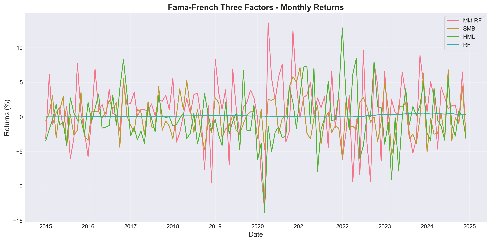
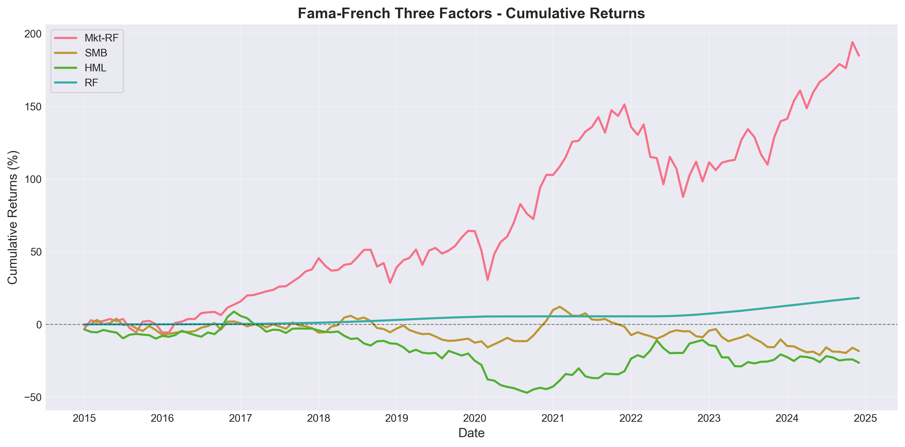

# 将项目提交到GitHub完整指南

## 📋 前置准备

### 1. 确认已安装Git
```bash
git --version
# 如果未安装，从 https://git-scm.com/ 下载安装
```

### 2. 配置Git（如果是首次使用）
```bash
git config --global user.name "你的用户名"
git config --global user.email "你的邮箱"
```

---

## 🚀 提交步骤

### 步骤1：初始化本地Git仓库

在项目根目录（D:\三因子模型）运行：

```bash
# 初始化Git仓库
git init

# 查看状态
git status
```

### 步骤2：添加文件到暂存区

```bash
# 添加所有文件
git add .

# 或者选择性添加
git add README.md
git add requirements.txt
git add src/
git add main.py
git add analysis_report.md
# ... 等等
```

**注意**：`.gitignore`文件已经配置好，会自动忽略以下内容：
- `__pycache__/` 和 `*.pyc`
- 虚拟环境目录
- IDE配置文件
- 部分数据和输出文件（可选）

### 步骤3：提交到本地仓库

```bash
git commit -m "Initial commit: Fama-French Three-Factor Model Analysis"
```

### 步骤4：在GitHub上创建新仓库

1. 访问 https://github.com/
2. 登录您的账户
3. 点击右上角 "+" → "New repository"
4. 填写仓库信息：
   - **Repository name**: `FamaFrench-ThreeFactor-Analysis` (建议名称)
   - **Description**: Comprehensive empirical analysis of Fama-French three-factor model using Python (2015-2024)
   - **Public** 或 **Private**: 根据需要选择
   - ⚠️ **不要**勾选 "Initialize this repository with a README"
   - ⚠️ **不要**添加 .gitignore 或 license（我们已经有了）

5. 点击 "Create repository"

### 步骤5：连接本地仓库到GitHub

GitHub会显示命令，或者手动运行：

```bash
# 添加远程仓库（替换YOUR_USERNAME为你的GitHub用户名）
git remote add origin https://github.com/YOUR_USERNAME/FamaFrench-ThreeFactor-Analysis.git

# 验证远程仓库
git remote -v
```

### 步骤6：推送到GitHub

```bash
# 推送到main分支
git branch -M main
git push -u origin main
```

如果遇到身份验证问题，可能需要：
- 使用 GitHub Personal Access Token
- 或配置 SSH key

---

## 📂 建议的仓库结构（已完成）

```
FamaFrench-ThreeFactor-Analysis/
├── README.md                           # 项目说明
├── LICENSE                             # MIT许可证
├── requirements.txt                    # Python依赖
├── .gitignore                          # Git忽略文件
├── config/
│   └── config.yaml                     # 配置文件
├── src/                                # 源代码
│   ├── __init__.py
│   ├── data_loader.py
│   ├── data_processor.py
│   ├── statistical_analysis.py
│   ├── regression_model.py
│   ├── visualization.py
│   └── report_generator.py
├── tests/                              # 单元测试
│   ├── __init__.py
│   ├── test_data_loader.py
│   ├── test_data_processor.py
│   ├── test_statistical_analysis.py
│   ├── test_regression_model.py
│   ├── test_visualization.py
│   └── test_report_generator.py
├── main.py                             # 主程序
├── comprehensive_analysis.py           # 全面分析
├── analyze_25_portfolios.py            # 25组合分析
├── pooled_regression_analysis.py       # 整体回归分析
├── analysis_report.md                  # 主分析报告
├── 25_portfolios_analysis_report.md    # 25组合报告
├── data/                               # 数据文件
│   ├── raw/
│   │   └── ff_three_factors.csv
│   └── processed/
│       └── 25_portfolios_synthetic.csv
├── output/                             # 输出结果
│   ├── figures/                        # 图表
│   │   ├── factors_timeseries.png
│   │   ├── cumulative_returns.png
│   │   ├── correlation_heatmap.png
│   │   ├── rolling_statistics.png
│   │   ├── rolling_correlations.png
│   │   ├── 25_portfolios_alpha_heatmap.png
│   │   ├── 25_portfolios_beta_distributions.png
│   │   └── pooled_regression_diagnostics.png
│   └── results/                        # 数据表格
│       ├── statistics_summary.csv
│       ├── correlation_matrix.csv
│       ├── 25_portfolios_regression_results.csv
│       └── pooled_regression_results.csv
└── issues/
    └── 三因子模型研究.md                # 项目任务记录
```

---

## 🔧 如果要修改.gitignore（可选）

如果您想**上传数据和输出文件**到GitHub，修改`.gitignore`：

```bash
# 注释掉以下行
# data/
# output/
# *.csv
# *.png
```

然后重新添加：
```bash
git add data/
git add output/
git commit -m "Add data and output files"
git push
```

---

## 📝 添加GitHub仓库描述和标签

在GitHub仓库页面：

1. **About** → 点击齿轮图标 ⚙️
2. **Description**: 
   ```
   Comprehensive empirical analysis of the Fama-French three-factor model using Python. 
   Includes regression analysis, statistical tests, and visualization (2015-2024 data).
   ```
3. **Topics** (标签):
   - `fama-french`
   - `three-factor-model`
   - `asset-pricing`
   - `empirical-finance`
   - `python`
   - `quantitative-finance`
   - `regression-analysis`
   - `portfolio-analysis`

---

## 🎯 创建完美的GitHub README

README.md已经包含：
- ✅ 项目介绍
- ✅ 功能特点
- ✅ 安装说明
- ✅ 使用示例
- ✅ 项目结构
- ✅ 测试说明
- ✅ 技术栈
- ✅ 参考文献

可以考虑添加：
- GitHub Stars 徽章
- License 徽章
- Python版本徽章

---

## 📊 后续维护

### 添加新文件
```bash
git add 新文件名
git commit -m "Add: 描述"
git push
```

### 更新文件
```bash
git add 已修改的文件
git commit -m "Update: 描述"
git push
```

### 查看历史
```bash
git log
git log --oneline
```

### 创建分支（可选）
```bash
git checkout -b feature/新功能名
# 开发完成后
git add .
git commit -m "Feature: 新功能描述"
git push -u origin feature/新功能名
# 在GitHub上创建Pull Request
```

---

## 🌟 增强仓库可见性

### 1. 添加GitHub Actions（可选）

创建 `.github/workflows/python-tests.yml`:
```yaml
name: Python Tests

on: [push, pull_request]

jobs:
  test:
    runs-on: ubuntu-latest
    steps:
    - uses: actions/checkout@v2
    - name: Set up Python
      uses: actions/setup-python@v2
      with:
        python-version: 3.10
    - name: Install dependencies
      run: |
        pip install -r requirements.txt
    - name: Run tests
      run: |
        pytest tests/
```

### 2. 添加示例数据和结果

在README中添加示例图表：
```markdown
## Sample Results



```

### 3. 创建Release

1. 在GitHub仓库页面点击 "Releases" → "Create a new release"
2. Tag version: `v1.0.0`
3. Release title: `Fama-French Three-Factor Analysis v1.0`
4. Description: 描述主要功能和发现
5. 附加文件：分析报告PDF、数据文件等

---

## ⚠️ 注意事项

### 1. 敏感信息
确保没有提交：
- API密钥
- 密码
- 个人信息
- 大文件（>100MB）

### 2. 大文件处理
如果有大于100MB的文件，使用Git LFS：
```bash
git lfs install
git lfs track "*.csv"
git lfs track "*.png"
git add .gitattributes
git commit -m "Add Git LFS tracking"
```

### 3. 文件编码
确保中文文件使用UTF-8编码

---

## 🎉 完成检查清单

提交前检查：
- [ ] README.md 完整且准确
- [ ] requirements.txt 包含所有依赖
- [ ] .gitignore 配置正确
- [ ] LICENSE 文件存在
- [ ] 代码可以运行
- [ ] 测试通过
- [ ] 没有敏感信息
- [ ] 提交信息清晰

---

## 📞 需要帮助？

如果遇到问题：
1. 查看Git错误信息
2. 使用 `git status` 检查状态
3. GitHub文档: https://docs.github.com/
4. Git文档: https://git-scm.com/doc

---

**祝您的项目在GitHub上获得成功！⭐**

