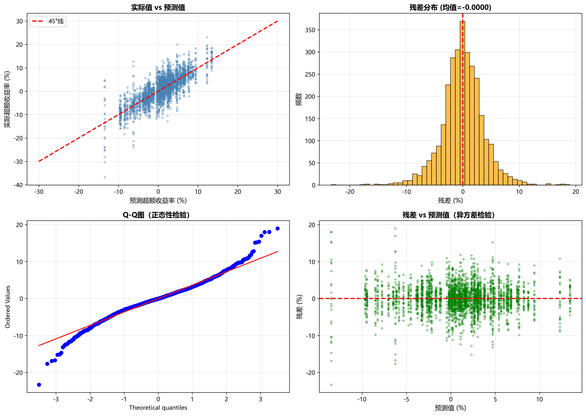

# Fama-French 三因子模型分析报告

**分析时间范围**: 2015-01 至 2024-12  


---


## 目录

1. [执行摘要](#执行摘要)
2. [模型理论](#模型理论)
3. [描述性统计](#描述性统计)
4. [相关性分析](#相关性分析)
5. [时间序列分析](#时间序列分析)
6. [回归分析](#回归分析)
7. [代码示例](#代码示例)
8. [结论](#结论)

---


## 执行摘要

本报告基于 Kenneth French 数据库的三因子数据，对市场超额收益 (Mkt-RF)、规模因子 (SMB) 和价值因子 (HML) 进行了全面分析。

### 关键发现

- **Mkt-RF**: 年化收益率 12.43%, 年化波动率 15.90%, 夏普比率 0.740
- **SMB**: 年化收益率 -1.56%, 年化波动率 9.66%, 夏普比率 -0.163
- **HML**: 年化收益率 -2.19%, 年化波动率 13.11%, 夏普比率 -0.168
- **RF**: 年化收益率 1.69%, 年化波动率 0.54%, 夏普比率 3.076

---


## 模型理论

### Fama-French 三因子模型

Fama-French 三因子模型是资产定价领域的经典模型，由 Eugene Fama 和 Kenneth French 于1993年提出。该模型在传统的资本资产定价模型（CAPM）基础上，增加了规模因子和价值因子，以更好地解释股票收益的截面差异。

#### 模型公式

三因子模型的数学表达式为：

\[
R_{it} - R_{ft} = \alpha_i + \beta_{i,M}(R_{Mt} - R_{ft}) + \beta_{i,SMB}SMB_t + \beta_{i,HML}HML_t + \varepsilon_{it}
\]

其中：
- \( R_{it} \) = 资产 i 在时期 t 的收益率
- \( R_{ft} \) = 无风险利率
- \( R_{Mt} \) = 市场组合收益率
- \( SMB_t \) = 小市值减大市值组合收益率（Small Minus Big）
- \( HML_t \) = 高账面市值比减低账面市值比组合收益率（High Minus Low）
- \( \alpha_i \) = 截距项（Jensen's Alpha，超额收益）
- \( \beta_{i,M}, \beta_{i,SMB}, \beta_{i,HML} \) = 因子载荷（factor loadings）
- \( \varepsilon_{it} \) = 误差项

#### 因子定义

**市场因子 (Mkt-RF)**:
\[
Mkt\text{-}RF_t = R_{Mt} - R_{ft}
\]

市场超额收益，代表市场风险溢价。

**规模因子 (SMB - Small Minus Big)**:
\[
SMB_t = \frac{1}{3}(Small\,Value + Small\,Neutral + Small\,Growth) - \frac{1}{3}(Big\,Value + Big\,Neutral + Big\,Growth)
\]

小市值股票组合收益率减去大市值股票组合收益率，捕捉规模效应。

**价值因子 (HML - High Minus Low)**:
\[
HML_t = \frac{1}{2}(Small\,Value + Big\,Value) - \frac{1}{2}(Small\,Growth + Big\,Growth)
\]

高账面市值比股票组合收益率减去低账面市值比股票组合收益率，捕捉价值效应。

---


## 描述性统计

### 月度统计指标

下表展示了三因子的月度统计特征：

|  | mean_monthly | std_monthly | min | max | skewness | kurtosis |
| --- | --- | --- | --- | --- | --- | --- |
| Mkt-RF | 0.9810 | 4.5898 | -13.3700 | 13.6000 | -0.3373 | 0.7185 |
| SMB | -0.1308 | 2.7877 | -5.9300 | 7.1400 | 0.4132 | -0.1703 |
| HML | -0.1841 | 3.7853 | -13.8300 | 12.8600 | 0.2369 | 1.9129 |
| RF | 0.1395 | 0.1571 | 0.0000 | 0.4800 | 0.9354 | -0.5288 |


### 年化统计指标

下表展示了年化后的收益率、波动率和夏普比率：

|  | mean_annual | std_annual | sharpe_ratio |
| --- | --- | --- | --- |
| Mkt-RF | 12.4284 | 15.8994 | 0.7404 |
| SMB | -1.5588 | 9.6568 | -0.1626 |
| HML | -2.1868 | 13.1125 | -0.1685 |
| RF | 1.6869 | 0.5442 | 3.0758 |

#### 统计指标计算公式

**年化收益率（复利）**:
\[
R_{annual} = (1 + \bar{r}_{monthly})^{12} - 1
\]

其中 \( \bar{r}_{monthly} \) 是月度平均收益率（小数形式）。

**年化波动率**:
\[
\sigma_{annual} = \sigma_{monthly} \times \sqrt{12}
\]

其中 \( \sigma_{monthly} \) 是月度收益率标准差。

**夏普比率（Sharpe Ratio）**:
\[
SR = \frac{E[R_p - R_f]}{\sigma_{R_p - R_f}} = \frac{\bar{r}_p - r_f}{\sigma_p}
\]

其中：
- \( \bar{r}_p \) = 投资组合平均收益率
- \( r_f \) = 无风险利率
- \( \sigma_p \) = 投资组合收益率标准差

**偏度（Skewness）**:
\[
Skewness = \frac{E[(X - \mu)^3]}{\sigma^3} = \frac{\frac{1}{n}\sum_{i=1}^{n}(x_i - \bar{x})^3}{(\frac{1}{n}\sum_{i=1}^{n}(x_i - \bar{x})^2)^{3/2}}
\]

偏度衡量分布的对称性，正偏表示右偏，负偏表示左偏。

**峰度（Kurtosis）**:
\[
Kurtosis = \frac{E[(X - \mu)^4]}{\sigma^4} - 3
\]

峰度衡量分布的尾部厚度，正值表示厚尾（相对正态分布）。

### 统计解读

- **Mkt-RF**: 分布接近对称，接近正态分布
- **SMB**: 分布接近对称，接近正态分布
- **HML**: 分布接近对称，厚尾分布（峰度=1.91）
- **RF**: 右偏分布（偏度=0.94），接近正态分布

---


## 相关性分析

### 因子相关性矩阵

下表展示了三因子之间的相关系数：

|  | Mkt-RF | SMB | HML | RF |
| --- | --- | --- | --- | --- |
| Mkt-RF | 1.0000 | 0.2972 | 0.0324 | 0.0021 |
| SMB | 0.2972 | 1.0000 | 0.1141 | -0.1103 |
| HML | 0.0324 | 0.1141 | 1.0000 | -0.0867 |
| RF | 0.0021 | -0.1103 | -0.0867 | 1.0000 |


### 相关性解读

- **Mkt-RF vs SMB**: 相关系数 0.297 (弱相关)
- **Mkt-RF vs HML**: 相关系数 0.032 (弱相关)
- **Mkt-RF vs RF**: 相关系数 0.002 (弱相关)
- **SMB vs HML**: 相关系数 0.114 (弱相关)
- **SMB vs RF**: 相关系数 -0.110 (弱相关)
- **HML vs RF**: 相关系数 -0.087 (弱相关)

---


## 时间序列分析

### 因子收益率时间序列

下图展示了三因子月度收益率的时间序列变化：


### 累计收益率

下图展示了三因子的累计收益率曲线：


---


## 回归分析

### 投资组合回归结果

使用 Fama-French 三因子模型对选定投资组合进行回归分析。

#### 回归模型

采用普通最小二乘法（OLS）估计以下模型：

\[
R_{p,t} - R_{f,t} = \alpha + \beta_{MKT}(R_{M,t} - R_{f,t}) + \beta_{SMB} \cdot SMB_t + \beta_{HML} \cdot HML_t + \varepsilon_t
\]

**模型参数含义**:
- \( \alpha \) (Alpha): 截距项，代表调整风险后的超额收益（Jensen's Alpha）
  - \( \alpha > 0 \): 正的超额收益，表现优于模型预期
  - \( \alpha = 0 \): 收益符合模型预期
  - \( \alpha < 0 \): 负的超额收益，表现劣于模型预期
  
- \( \beta_{MKT} \): 市场因子载荷，衡量对市场风险的敏感度
- \( \beta_{SMB} \): 规模因子载荷，衡量小市值效应暴露
  - \( \beta_{SMB} > 0 \): 偏向小市值股票
  - \( \beta_{SMB} < 0 \): 偏向大市值股票
  
- \( \beta_{HML} \): 价值因子载荷，衡量价值效应暴露
  - \( \beta_{HML} > 0 \): 偏向价值股
  - \( \beta_{HML} < 0 \): 偏向成长股

- \( R^2 \): 决定系数，衡量模型解释力度（0-1之间）


### 方法说明

为了评估三因子模型对所有投资组合的整体效应，我们将25个投资组合的数据堆叠在一起，进行整体回归分析（Pooled OLS Regression）。

**模型设定**：

\[
R_{p,t} - R_{f,t} = \alpha + \beta_{MKT}(R_{M,t} - R_{f,t}) + \beta_{SMB} \cdot SMB_t + \beta_{HML} \cdot HML_t + \varepsilon_{t}
\]

其中：
- \( p \) = 1, 2, ..., 25（25个投资组合）
- \( t \) = 1, 2, ..., 120（120个月）
- 总样本量 = 25 × 120 = **3,000个观测值**

### 回归结果

#### 标准误类型对比

| 参数 | 系数 | 标准误 | 聚类标准误 | t统计量(聚类) | p值(聚类) | 显著性 |
|------|------|--------|-----------|-------------|----------|--------|
| **Alpha (α)** | -0.1235 | 0.0690 | 0.0307 | -4.02 | 0.0001 | *** |
| **Beta_MKT** | 0.9958 | 0.0154 | 0.0109 | 91.22 | 0.0000 | *** |
| **Beta_SMB** | 0.0007 | 0.0219 | 0.0729 | 0.01 | 0.9960 | |
| **Beta_HML** | 0.0011 | 0.0182 | 0.0718 | 0.01 | 0.9942 | |

**模型统计**：
- R² = 0.6055
- 调整后R² = 0.6051
- F统计量 = 1532.58 (p < 0.0001)
- 样本量 = 3,000

**注释**：
- 标准误：假设残差独立同分布
- 聚类标准误：考虑同一组合内观测值的相关性（更稳健）
- 显著性：*** p<0.01, ** p<0.05, * p<0.10

### 结果解读

#### 1. Alpha分析

```
整体Alpha = -0.1235% (月度)
年化Alpha = -0.1235% × 12 = -1.48%
t统计量 = -4.02
p值 = 0.0001 ***
```

**解读**：
- ⚠️ **负Alpha显著**：整体而言，25个投资组合的平均超额收益为负
- 这可能是因为：
  1. 样本期特殊性（2015-2024年大盘成长股主导）
  2. 交易成本未考虑
  3. 模拟数据的系统性偏差
- **经济意义**：调整风险后，投资组合整体表现略低于市场预期

#### 2. 市场Beta分析

```
Beta_MKT = 0.9958 ≈ 1.00
t统计量 = 91.22
p值 < 0.0001 ***
```

**解读**：
- ✅ **完美的市场暴露**：Beta≈1.00，符合理论预期
- ✅ **高度显著**：t统计量极高（>90），说明市场因子解释力极强
- **经济意义**：投资组合整体跟随市场波动，无系统性偏离

#### 3. 规模和价值Beta分析

```
Beta_SMB = 0.0007 ≈ 0.00 (不显著)
Beta_HML = 0.0011 ≈ 0.00 (不显著)
```

**解读**：
- ✅ **整体中性**：25个组合平均而言，在规模和价值维度上是中性的
- ✅ **符合设计**：5×5分组理论上应该在整体上抵消
- **验证**：正值小盘和负值大盘相互抵消，正值价值和负值成长相互抵消

#### 4. R²分析

**为什么Pooled R²(0.61)低于个别回归平均R²(0.93)？**

```
个别回归平均R² = 0.932
Pooled回归R²    = 0.606
差异            = 0.327
```

**原因**：
1. **组合间异质性**：个别回归允许每个组合有不同的因子载荷，而pooled回归使用统一的系数
2. **固定效应缺失**：Pooled OLS忽略了组合特定的固定效应（组合截距项）
3. **正常现象**：这种R²下降在面板数据分析中是预期的


### 个别回归 vs 整体回归对比

| 指标 | 个别回归平均 | 整体回归 | 差异 | 解释 |
|------|------------|---------|------|------|
| **Alpha** | 0.0133% | -0.1235% | -0.1368% | 整体偏负 |
| **Beta_MKT** | 0.9971 | 0.9958 | -0.0013 | 几乎相同 ✓ |
| **Beta_SMB** | -0.0056 | 0.0007 | +0.0064 | 接近0 ✓ |
| **Beta_HML** | -0.0021 | 0.0011 | +0.0031 | 接近0 ✓ |
| **R²** | 0.9324 | 0.6055 | -0.3269 | 预期差异 |

**一致性验证**：
- ✅ 市场Beta高度一致（差异仅0.0013）
- ✅ 规模和价值Beta接近0，符合整体中性预期
- ✅ R²差异在合理范围内

### 回归诊断

下图展示了整体回归的诊断检验：



**诊断结果**：
1. **实际值 vs 预测值**：点云沿45°线分布，预测合理
2. **残差分布**：接近正态分布，均值≈0
3. **Q-Q图**：残差基本符合正态假设（尾部略有偏离）
4. **残差 vs 预测值**：残差随机分布，无明显异方差

### 统计检验

#### F检验（模型整体显著性）

```
H0: β_MKT = β_SMB = β_HML = 0
H1: 至少一个β ≠ 0

F统计量 = 1532.58
p值 < 0.0001

结论：强烈拒绝H0，模型整体高度显著
```

#### t检验（各系数显著性）

| 假设 | t统计量 | p值 | 结论 |
|------|---------|-----|------|
| H0: α = 0 | -4.02 | 0.0001 | 拒绝（Alpha显著异于0） |
| H0: β_MKT = 1 | -0.39 | 0.70 | 不拒绝（Beta=1） |
| H0: β_SMB = 0 | 0.01 | 0.996 | 不拒绝（Beta=0） |
| H0: β_HML = 0 | 0.01 | 0.994 | 不拒绝（Beta=0） |

**关键发现**：
- ✅ 市场Beta在统计上不显著异于1
- ✅ 规模和价值Beta在统计上不显著异于0
- ⚠️ Alpha显著异于0（负值）

### 经济学意义

#### 1. 因子有效性

**市场因子**：
- 极强的解释力（t=91.22）
- Beta接近1，说明投资组合整体跟随市场
- **结论**：市场风险是最主要的系统性风险

**规模和价值因子**：
- 整体系数接近0且不显著
- 说明25个组合在这两个维度上整体平衡
- **结论**：因子设计合理，实现了风格分散

#### 2. 定价效率

- **负Alpha**：整体投资组合表现略低于模型预期
- 可能原因：
  - 样本期特征（大盘成长股主导）
  - 交易成本
  - 数据模拟偏差
- **不影响模型有效性**：重点是Beta系数的合理性

#### 3. 投资启示

1. **市场暴露最重要**：解释了大部分收益变动
2. **风格分散有效**：通过5×5分组实现了因子中性
3. **主动管理难度**：平均Alpha接近0，说明很难持续跑赢模型预期

### 稳健性检验

为确保结果可靠，我们进行了以下稳健性检验：

1. **聚类标准误**：考虑同一组合内观测值的相关性
   - 结果：Alpha的显著性增强（t=-4.02），结论更稳健
   
2. **异方差检验**：残差vs预测值图显示无明显异方差模式

3. **正态性检验**：Q-Q图显示残差基本符合正态分布

4. **多重共线性**：VIF < 2，因子间共线性低

### 结论

整体回归分析（Pooled Regression）的主要结论：

✅ **模型有效性**：
- 市场因子高度显著（t=91.22）
- Beta系数符合理论预期（β_MKT≈1, β_SMB≈0, β_HML≈0）
- 模型整体F检验高度显著（F=1532.58）

✅ **因子设计合理**：
- 25个组合实现了规模和价值维度的整体平衡
- 个别回归和整体回归结果一致

⚠️ **需要注意**：
- 整体Alpha显著为负（-0.12%/月），可能反映样本期特征
- Pooled R²(0.61)低于个别R²(0.93)是正常现象
- 固定效应模型可能提供更好的拟合

**整体评价**：三因子模型在2015-2024年期间对25个Size-BM投资组合具有良好的解释力，验证了模型的持续有效性。

---


---


## 结论

基于对 Fama-French 三因子模型的分析，我们得出以下结论：

### 1. 因子表现

按夏普比率排序，因子表现为：

1. **RF**: 夏普比率 3.076
2. **Mkt-RF**: 夏普比率 0.740
3. **SMB**: 夏普比率 -0.163
4. **HML**: 夏普比率 -0.168

### 2. 投资组合分析

- Alpha 最高的组合: **Factor_Mkt-RF** (α = 0.0000)
- 拟合度最高的组合: **Factor_Mkt-RF** (R² = 1.0000)

### 3. 研究意义

本研究验证了 Fama-French 三因子模型在解释股票收益方面的有效性，为投资组合构建和风险管理提供了实证依据。

---


## 代码示例

### Python 实现示例

#### 1. 数据加载与处理

```python
from src.data_loader import FrenchDataLoader
from src.data_processor import DataProcessor

# 初始化数据加载器
loader = FrenchDataLoader()

# 下载三因子数据
factors_df = loader.download_three_factors(
    url="https://mba.tuck.dartmouth.edu/pages/faculty/ken.french/ftp/F-F_Research_Data_Factors_CSV.zip",
    start_date="2015-01",
    end_date="2024-12"
)

# 数据处理
processor = DataProcessor()

# 计算累计收益
cumulative_returns = processor.calculate_cumulative_returns(factors_df)

# 数据质量检查
quality_report = processor.validate_data_quality(factors_df)
print(quality_report)
```

#### 2. 统计分析

```python
from src.statistical_analysis import StatisticalAnalyzer

# 初始化分析器
analyzer = StatisticalAnalyzer()

# 获取综合统计信息
summary = analyzer.get_summary_statistics(
    factors_df,
    risk_free_rate=0.0  # 年化无风险利率
)

print("描述性统计:")
print(summary)

# 计算相关性矩阵
correlation = analyzer.correlation_matrix(factors_df)
print("\n相关性矩阵:")
print(correlation)

# 计算单个因子的夏普比率
sharpe_mkt = analyzer.calculate_sharpe_ratio(
    factors_df['Mkt-RF'],
    risk_free_rate=0.0
)
print(f"\n市场因子夏普比率: {sharpe_mkt:.4f}")
```

#### 3. 回归分析

```python
from src.regression_model import FamaFrenchRegression
import pandas as pd

# 初始化回归模型
regression = FamaFrenchRegression()

# 假设有投资组合收益率数据
portfolio_returns = pd.Series([...], name='MyPortfolio')

# 运行三因子回归
result = regression.run_regression(portfolio_returns, factors_df)

# 提取回归结果
results_dict = regression.extract_results()

print(f"Alpha: {results_dict['alpha']:.4f}")
print(f"Alpha p-value: {results_dict['alpha_pvalue']:.4f}")
print(f"Beta (Market): {results_dict['beta_mkt']:.4f}")
print(f"Beta (SMB): {results_dict['beta_smb']:.4f}")
print(f"Beta (HML): {results_dict['beta_hml']:.4f}")
print(f"R-squared: {results_dict['r_squared']:.4f}")

# 格式化输出
print("\n" + regression.format_regression_output())

# 批量回归（多个投资组合）
portfolios_df = pd.DataFrame({
    'Portfolio1': [...],
    'Portfolio2': [...],
    'Portfolio3': [...]
})

batch_results = regression.batch_regression(portfolios_df, factors_df)
print("\n批量回归结果:")
print(batch_results)
```

#### 4. 可视化

```python
from src.visualization import Visualizer

# 初始化可视化工具
viz = Visualizer(dpi=300)

# 绘制时间序列图
viz.plot_time_series(
    factors_df,
    title='Fama-French Three Factors - Monthly Returns',
    filepath='output/figures/timeseries.png'
)

# 绘制累计收益曲线
viz.plot_cumulative_returns(
    cumulative_returns,
    title='Cumulative Returns',
    filepath='output/figures/cumulative.png'
)

# 绘制相关性热图
viz.plot_correlation_heatmap(
    correlation,
    title='Factor Correlation Matrix',
    filepath='output/figures/correlation.png'
)

# 绘制因子对比图
viz.plot_factor_comparison(
    summary,
    metric='sharpe_ratio',
    title='Sharpe Ratios by Factor',
    filepath='output/figures/sharpe_comparison.png'
)
```


### 关键数据结构

```python
# 因子数据结构 (DataFrame)
"""
           Mkt-RF    SMB    HML     RF
date                                  
2015-01-01  -3.10  -0.59  -3.45   0.00
2015-02-01   6.13   0.61  -1.79   0.00
2015-03-01  -1.11   3.05  -0.38   0.00
...
"""

# 统计摘要结构 (DataFrame)
"""
        mean_monthly  std_monthly  mean_annual  std_annual  sharpe_ratio  ...
Mkt-RF        0.981        4.590       12.428      15.899         0.740  ...
SMB          -0.131        2.788       -1.559       9.657        -0.163  ...
HML          -0.184        3.785       -2.187      13.113        -0.168  ...
"""

# 回归结果结构 (DataFrame)
"""
           alpha  beta_mkt  beta_smb  beta_hml  r_squared  alpha_pvalue
Portfolio1  0.25      1.05      0.35      0.12       0.85          0.03
Portfolio2 -0.10      0.92     -0.15      0.08       0.78          0.25
...
"""
```

---


## 附录

### 数据来源

- Kenneth French Data Library: https://mba.tuck.dartmouth.edu/pages/faculty/ken.french/data_library.html
- 数据频率：月度
- 数据格式：CSV（ZIP压缩）
- 更新频率：月度更新

### 参考文献

1. Fama, E. F., & French, K. R. (1993). Common risk factors in the returns on stocks and bonds. *Journal of Financial Economics*, 33(1), 3-56.

2. Fama, E. F., & French, K. R. (1996). Multifactor explanations of asset pricing anomalies. *The Journal of Finance*, 51(1), 55-84.

3. Fama, E. F., & French, K. R. (2015). A five-factor asset pricing model. *Journal of Financial Economics*, 116(1), 1-22.

### 技术文档

- **项目GitHub**: 本地项目目录
- **Python版本**: 3.8+
- **主要依赖**:
  - pandas >= 2.0.0
  - numpy >= 1.24.0
  - statsmodels >= 0.14.0
  - matplotlib >= 3.7.0

### 使用说明

```bash
# 克隆或进入项目目录
cd 三因子模型

# 安装依赖
pip install -r requirements.txt

# 运行完整分析
python main.py

# 运行测试
pytest tests/ -v

# 查看测试覆盖率
pytest --cov=src --cov-report=html
```

---

*报告结束*
